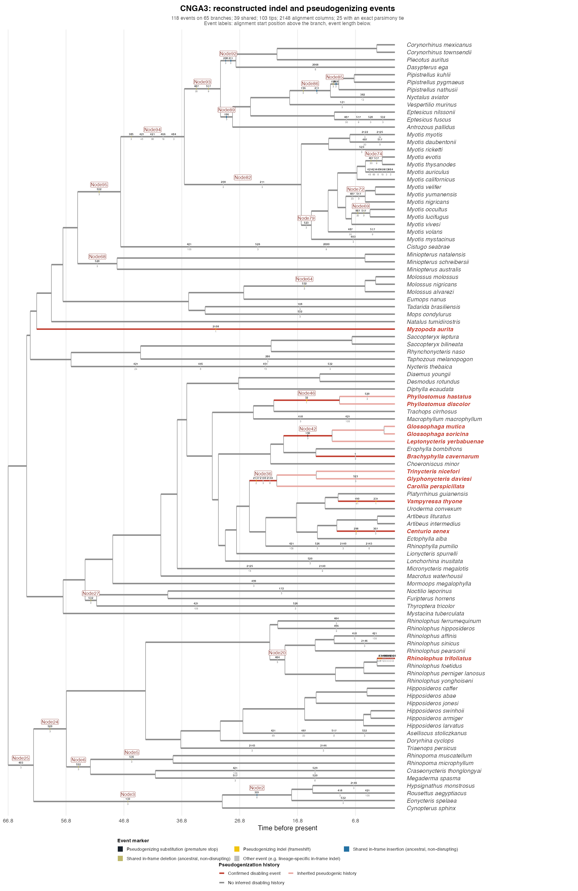
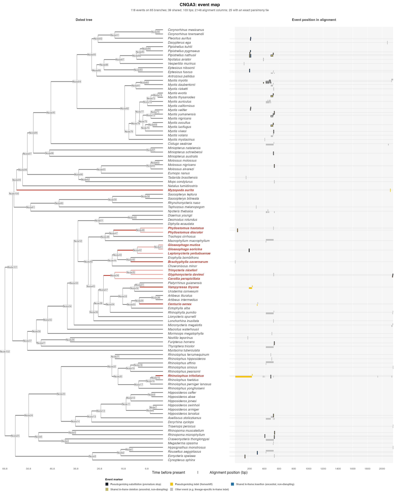

# Pensieve

**Reconstruct where and when a gene broke.**

Pensieve is a gene-centred workflow for reconstructing **where coding-sequence lesions arose on a rooted species tree**. It combines a frameshift-aware MACSE alignment, PAML `codeml` ancestral nucleotide reconstruction, and its own parsimony-based event/history engine to answer, for any coding gene and any rooted tree of species: *which lineage lost this gene first, is the loss shared or independent, and what exactly broke it (a premature stop, a frameshifting indel, or something ambiguous)?* The result is a fully reconstructed ancestral sequence at every internal node and two publication-ready figures per gene.

v3.31 made installation/execution portable across local machines and HPC systems (no assumption of Miniforge, mamba, or any site-specific module command); every release since has kept that portability while fixing real bugs found by running Pensieve on real genomes, listed in full in [`CHANGELOG.md`](CHANGELOG.md). The current release is v3.36 (see `VERSION`).

---

## Contents

- [Quick install](#quick-install)
- [Example output](#example-output)
- [Basic run](#basic-run)
- [Reference-free design](#reference-free-design)
- [Phylogenetic sequence ordering](#phylogenetic-sequence-ordering)
- [Core inference contract](#core-inference-contract)
- [Full installation reference](#installation)
- [Important output files](#important-output-files)
- [Validation](#validation)

---

## Quick install

Pick whichever matches where you're running Pensieve. Both end with the same `Pensieve` conda/mamba environment; pick one.

**Local machine (Mac/Linux, conda or mamba already on `PATH`)**

```bash
git clone <this-repository-url> Pensieve
cd Pensieve
bash install.sh
```

`install.sh` auto-detects mamba, falls back to conda, and falls back further to a staged, lower-memory install if the environment solve gets OOM-killed. It also clones and wires up IndelMaP (optional concordance checking) and PAML/`codeml` automatically. See [Full installation reference](#installation) for venv-only, current-environment, and other backends.

**HPC cluster, interactive session**

A bare `salloc` on many clusters does **not** put conda/mamba on your `PATH` by itself — you still need to load the site's module for it first. A typical interactive setup looks like:

```bash
salloc --partition=compute --time=02:00:00 --mem=64G
ml miniforge
bash install.sh
```

Adjust `--partition`, `--time`, and `--mem` to your own cluster/queue and to the gene(s)/tree size you're running (a 100+ tip tree with a genuinely long gene benefits from the full 64G during the `codeml` ancestral reconstruction step). `ml miniforge` (or your site's equivalent module name — Pensieve never guesses this for you) is what actually exposes `conda`/`mamba` inside the allocation; skipping it is the most common reason `install.sh` or `pensieve` itself appears to "not find" conda on a cluster that definitely has it installed somewhere.

Once installed, activate and run exactly as you would locally:

```bash
conda activate Pensieve   # or: mamba activate Pensieve
pensieve --gene GUCA1B --fasta GUCA1B.fasta --tree dated_tree.nwk --workdir GUCA1B_run
```

For submitting Pensieve itself as a Slurm **batch** job (rather than working interactively inside a `salloc` session), see [Slurm](#slurm) below — `--mode slurm` runs the entire workflow, including `codeml`, inside one submitted job.

## Example output

Every gene run produces two figures. Below are both, from a real 103-species bat run of **CNGA3** (a gene with several independent and shared pseudogenization events — a good example of the kind of history Pensieve is designed to resolve).

**`<GENE>.pseudogenization_tree.pdf`** — the headline figure. Branches are coloured by reconstructed ORF history: grey where the gene stayed intact, saturated red on the branch where it was first confidently disabled, pale red on every descendant branch that inherited that loss, and amber where the reconstruction is genuinely ambiguous. Species names in red are pseudogenized. Small boxed labels on branches show each event's alignment start position (above) and length (below).



**`<GENE>.event_map.pdf`** — every reconstructed event plotted at its real position in the alignment, next to the same tree, so events that land on the same branch (rather than stacking illegibly) separate out along the alignment axis. Useful for seeing at a glance whether a gene's lesions cluster in one region or are scattered throughout the coding sequence.



Both are written as paired PDF (vector, for publication) and PNG (for quick viewing/embedding) to `final_results/<GENE>/important_output/`.

## Reference-free design

Pensieve v3.31 has **no reference species or reference sequence**. No human, outgroup, first complete ORF, or other taxon is used to define indels, coordinates, event polarity, diagnostics, ASR, or plots. All lesion coordinates are 1-based/inclusive positions in the canonical alignment. The exact file defining those coordinates is copied to `final_results/<GENE>/important_output/<GENE>.canonical_alignment.fasta`.

## Phylogenetic sequence ordering

Pensieve does **not** alphabetically sort MSA rows. Sequence order follows the left-to-right order of the rooted, pruned user tree. This changes only FASTA record order; alignment columns and all alignment coordinates remain unchanged.

- Tip-only FASTAs use the tree's terminal order.
- PAML-only internode FASTAs use rooted phylogenetic preorder after topology-based node mapping.
- The combined tip+internode MSA uses deterministic depth-first preorder: an internal ancestor is written immediately before the clade descending from it.
- The biological root is listed in the order audit, but under `clock=0` it is omitted from sequence FASTAs when no distinct PAML root sequence exists.

For manual inspection, the main files are:

```text
final_results/<GENE>/important_output/<GENE>.canonical_alignment.fasta
final_results/<GENE>/important_output/<GENE>.phylogenetic_msa.fasta
final_results/<GENE>/important_output/<GENE>.phylogenetic_tip_order.tsv
final_results/<GENE>/important_output/<GENE>.phylogenetic_sequence_order.tsv
```

The order tables make the chosen display order reproducible and record node type, parent/depth, and descendant tips.

## Core inference contract

Pensieve v3.31 assigns one job to each layer:

- **MACSE**: frameshift-aware coding-sequence alignment/diagnosis.
- **Pensieve breakpoint engine**: homologous indel-character definition and transparent tree-based event reconstruction.
- **codeml**: marginal ancestral nucleotide/codon reconstruction on a fixed topology.
- **IndelMaP (optional)**: independent indel-aware concordance check; it never overwrites Pensieve's authoritative gap states.
- **Pensieve ORF walk**: combines PAML nucleotide scaffolds with Pensieve lesion states, reconstructs native ancestral CDSs, and distinguishes first loss, inherited loss history and apparent compensatory restoration.

The authoritative order is:

```text
raw CDS + rooted tree
       |
       v
00 ORF/taxon audit
       |
       v
01 MACSE diagnosis/alignment
       |
       v
02 one canonical alignment
       |-----------------------------|
       v                             v
native structural view          PAML-safe view
       |                             |
       v                             v
03 breakpoint/STOP events       codeml ASR
       |                             |
       |---------+-------------------|
                 v
04 lesion-aware native ancestors
   + ORF/pseudogenic-history walk
                 |
                 v
05 figures

Optional IndelMaP -----------------> concordance table only
```

See `INFERENCE_SPEC.md` for the detailed scientific rules.

## Installation

Full reference for every install backend. If you just want the two most common paths (local conda/mamba, or an HPC `salloc` session), see [Quick install](#quick-install) above.

Pensieve itself does **not** require mamba and does not execute `ml miniforge` or any other HPC-specific module command — that module, if your site needs one at all, is always the user's/site's own choice, not something Pensieve guesses. Choose the backend appropriate for the machine.

### Conda/mamba environment

Auto-detect mamba then conda:

```bash
bash install.sh
```

Or choose explicitly:

```bash
bash install.sh --backend=mamba
bash install.sh --backend=conda
```

For clusters where environment solving is memory-heavy, staged installation remains available:

```bash
bash install.sh --backend=staged
```

The named environment is `Pensieve` by default and can be changed with `--env-name=NAME`.

### Python virtual environment

Pensieve can create a standard Python venv without conda/mamba:

```bash
bash install.sh --backend=venv
source .venv/bin/activate
```

This installs Python dependencies only. MACSE, codeml/PAML and R/Rscript must already be available through the operating system, modules, a container, or another package manager.

### Use the current environment; create nothing

```bash
bash install.sh --backend=current
```

This installs Python dependencies into the current Python and creates no conda/mamba/venv environment.

### HPC modules

Pensieve never assumes a module name. If your HPC requires a module to expose conda/mamba or external tools, load it yourself before installation or use the optional runtime `--slurm-module NAME` flag. For example, the site might require `module load <site-specific-name>`; that choice belongs to the user/site, not Pensieve.

The existing `environment.yml` still contains several historical compatibility packages such as IQ-TREE and MUSCLE; **v3.31 does not call IQ-TREE or MUSCLE in its core workflow**.

## Help

All of the established help forms are retained:

```bash
pensieve -h
pensieve -help
pensieve --help
pensieve --help -long
pensieve --help --long
```

The long help is the command-line manual and documents current stage names, aliases, options, outputs and limitations.

## Basic run

```bash
pensieve \
  --gene GUCA1B \
  --fasta GUCA1B.fasta \
  --tree dated_tree.nwk \
  --workdir GUCA1B_run
```

### Slurm

```bash
pensieve \
  --gene GUCA1B \
  --fasta GUCA1B.fasta \
  --tree dated_tree.nwk \
  --workdir GUCA1B_run \
  --mode slurm \
  --threads 4 \
  --time 120 \
  --slurm-mem 64G
```

In Slurm mode the **whole Pensieve workflow is one Slurm job** and codeml executes inside that allocation. No `ml miniforge`, `mamba activate`, or `conda activate` line is inserted automatically. The default `--env-mode inherit` uses the environment/PATH inherited from the submission shell. If activation was not inherited, use `--env-mode conda --env-name Pensieve`, `--env-mode mamba --env-name Pensieve`, or `--env-mode venv --venv-path /path/to/.venv`. Conda/mamba modes use `conda run` / `mamba run`, which avoids interactive-shell activation requirements. If a cluster genuinely requires a module, pass `--slurm-module NAME`; Pensieve never chooses the module name itself.

Examples:

```bash
# Submit from an already activated/current environment
pensieve ... --mode slurm --env-mode inherit

# Do not activate in the batch shell; execute the workflow through conda
pensieve ... --mode slurm --env-mode conda --env-name Pensieve

# Standard Python venv
pensieve ... --mode slurm --env-mode venv --venv-path /path/to/Pensieve/.venv

# Optional site module, only when your cluster requires it
pensieve ... --mode slurm --env-mode conda --slurm-module YOUR_SITE_MODULE
```

## Alignment modes

### `--alignment perform`

MACSE's nucleotide alignment is the canonical coordinate system. Pensieve no longer creates a second MUSCLE alignment and no longer projects MACSE lesions between two independently generated alignments.

Two synchronized FASTAs contain the same columns:

```text
02_GENE.primary_codon_alignment_native.fasta
02_GENE.primary_codon_alignment.fasta
```

The first is the native structural view; the second is the PAML-safe view.

### `--alignment defined`

The supplied alignment is authoritative. Pensieve:

- prunes it to shared taxa;
- never inserts a column;
- never deletes a column;
- never realigns it or changes alignment columns;
- reorders FASTA records only to match the rooted tree for inspection;
- requires equal sequence lengths and a length divisible by three.

If those requirements are not met, Pensieve fails rather than silently changing the user's alignment.

## MACSE `!` handling

A MACSE `!` is a **partial-codon/frame-restoration placeholder**, not intrinsically a one-base deletion.

v3.31 therefore uses:

```text
native structural view: ! -> -
PAML-safe view:         ! -> N
```

Removing `!` as a placeholder in the native view does **not** assign event direction. Insertion/deletion direction is inferred later from the complete residue/gap pattern and the rooted tree.

This is important for patterns in which `!!N` can be associated with an underlying insertion rather than a deletion.

## Premature STOP handling

Raw in-frame premature STOPs are recorded before PAML masking, mapped onto canonical alignment coordinates, and retained with the exact allele (`TAA`, `TAG` or `TGA`).

The PAML-safe alignment masks exact STOP codons to `NNN`, while the native view retains the observed allele.

Different STOP alleles at the same aligned codon are separate characters. A TGA and a TAA at the same location are not automatically called the same mutation.

A raw stop is classified using the **MACSE frame phase at that exact position**, not merely the existence of any earlier `!` marker. Pensieve sums upstream MACSE partial-codon correction lengths modulo three. If the phase is still shifted, the STOP is retained as a likely frameshift consequence; if compensating frameshifts restore phase (`mod 3 = 0`), the STOP remains eligible as an independent nonsense-mutation character.

## Breakpoint event logic

The v3.25 breakpoint decomposition is retained and strengthened.

For a GUCA1B-style pattern:

```text
M. australis       gap 646-696
M. natalensis      gap 646-687
M. schreibersii    gap 646-687
Nycteris            gap 661-669
```

Pensieve decomposes this into:

```text
646-687  shared Miniopterus character
688-696  M. australis extension
661-669  independent Nycteris interior character
```

A taxon with a smaller interior gap is **ABSENT** for the larger character if known residues occur elsewhere inside that character. A taxon whose different, larger deletion spans the entire smaller character is `UNKNOWN` for the smaller event. This distinction is what prevents the Nycteris deletion from splitting or being merged into the Miniopterus history.

## Parsimony and ambiguity

Gap/residue and STOP-presence characters are reconstructed with equal-cost binary Sankoff parsimony by default.

An exact tie remains an exact tie.

```bash
--tie-break none       # default
--tie-break ancestral
--tie-break terminal
```

`ancestral` and `terminal` can choose a representative history for a table/plot that requires one, but they **never** convert a tied biological inference to a confident call. Tied event rows remain:

```text
ambiguous_origin = True
direction_confident = False
biological_interpretation = ambiguous_indel_change / ambiguous_stop_change
```

This prevents the v3.25 failure in which a root tie could be rendered as a definitive deletion.

## Signed frame arithmetic

Frame state is tracked separately from premature STOPs.

For confident structural transitions:

```text
deletion:              negative bp change
insertion/restoration: positive bp change
frame offset:          signed cumulative change mod 3
```

A premature STOP does not alter reading frame and is not counted as a frame shift.

A compensatory indel may return the current frame offset to zero, but `frameshifting_events_in_history` remains non-zero and pseudogenic history is not erased.

## codeml settings

The core control file uses:

```text
clock = 0
fix_blength = 0
RateAncestor = 1
cleandata = 0
method = 1
```

Thus codeml estimates its own branch lengths under its codon model. IQ-TREE branch lengths are not needed.

With `clock = 0`, the biological dated root does not have a distinct PAML marginal sequence. Pensieve therefore does **not fabricate a root sequence**. The root can have reconstructed structural states, but its full sequence-based ORF status is reported as unavailable.

## IndelMaP

```bash
--indelmap auto   # default; attempt when available, warn/continue if unavailable/fails
--indelmap yes    # explicitly request an attempt
--indelmap no     # skip it
```

IndelMaP is an independent evidence layer. Its ancestral gaps are never projected onto the authoritative PAML scaffold.

The comparison is written to:

```text
03_GENE.indelmap_concordance.tsv
```

A PDE6H-specific IndelMaP failure therefore does not destroy the core Pensieve reconstruction.

## Ancestral sequence integration

For every non-root internal node:

1. take the PAML marginal nucleotide sequence as the substitution scaffold;
2. map the PAML node to a Pensieve `Node<i>` by topology;
3. overwrite a character interval with `-` only when Pensieve reconstructs `gap` there;
4. retain the PAML base when Pensieve reconstructs `residue`;
5. reinsert an exact premature STOP allele when that STOP character is reconstructed present;
6. mark structural ambiguity rather than forcing a state.

Principal outputs:

```text
03_GENE.paml_marginal_asr.fa
03_GENE.ancestral_integrated_alignment.fa
03_GENE.phylogenetic_msa.fa
03_GENE.ancestral_native_cds.fa
03_GENE.phylogenetic_sequence_order.tsv
03_GENE.internode_label_crosswalk.tsv
```

## ORF state versus pseudogenic history

These are deliberately separate concepts.

A node can be:

```text
intact
  no definite ORF disruption and no material unresolved sequence/structure

disrupted
  definite missing start, non-triplet CDS length, or internal exact STOP

uncertain
  unresolved bases/structural states prevent a confident call

unavailable
  no ancestral nucleotide sequence exists, notably the clock=0 biological root
```

Branch history then uses explicit epistemic states rather than one generic `uncertain` bucket:

```text
pseudogenization
  first confidently placed disabling branch

already_pseudogenic
  descendant of a known earlier loss

apparent_orf_restoration
  apparent frame/ORF becomes intact after an earlier loss, but pseudogenic
  history remains inherited

confirmed_disabling_event_first_loss_unresolved
  a real disabling event is on this branch, but entering history is unresolved

root_adjacent_disruption_first_loss_unresolved
  child sequence is disrupted immediately below the biological root; the child
  has pseudogenic history, but clock=0 supplies no distinct biological-root
  sequence with which to prove that this branch is the first loss

sequence_disruption_first_loss_unresolved
  child is definitely disrupted but the parent state/history is insufficient to
  assign the first loss confidently

ambiguous_disabling_event
  a potentially disabling event exists but its origin/direction is ambiguous

sequence_state_uncertain / history_uncertain_no_confirmed_event
  uncertainty comes from sequence/state/history rather than a confirmed lesion

intact
  no inferred disabling history on the branch
```

`04_<GENE>.orf_transitions_by_branch.tsv` also reports `transition_evidence` and `uncertainty_reason`. A compensatory frameshift therefore does not produce a misleading loss → revival → loss tree.


## Safe handling of codeml joint-reconstruction failures

Pensieve requires **PAML marginal ancestral reconstruction**, not PAML's later optional joint reconstruction. Some codeml runs can complete and flush the marginal ASR, enter `Joint reconstruction`, and then return a non-zero exit status. v3.31 retains the v3.30 rule and validates the biological output instead of blindly treating every non-zero process status as total ASR failure.

The rule is deliberately simple and driven by the actual `rst`:

```text
read:  Nodes X to Y are ancestral
expected marginal sequences = Y - X + 1
        |
        v
parse ONLY section (1) Marginal reconstruction
        |
        +-- every node X..Y occurs exactly once with the expected alignment length
        |       -> marginal ASR VALID
        |       -> CONTINUE even if codeml later exits non-zero in Joint reconstruction
        |
        +-- any declared node missing/duplicated/wrong-length
                -> FAIL
```

Pensieve does **not** use `n_tips - 2` or any other guessed PAML node count as an ASR-completeness gate. For example, if a 103-tip `rst` says `Nodes 104 to 205 are ancestral`, Pensieve expects exactly `(205-104)+1 = 102` marginal sequences. A global `grep -c "node #" rst` may be 204 when PAML also writes the same 102 nodes in the joint section; only the marginal section is required by Pensieve.

The same parser is used by the backend validator and downstream integration, so there is no second, competing interpretation of `rst` structure.

The PAML TreeView representation can contain one degree-2 Newick serialization/root vertex in addition to the degree-3 biological unrooted internodes. Its marginal sequence is retained in `03_<GENE>.paml_marginal_asr_all_declared_nodes.fa` for audit, but is not assigned to the biological dated root under `clock=0`.

Before codeml starts, Pensieve deletes any old `rst` and related PAML outputs, so a stale file cannot satisfy this validation. The decision is recorded in:

```text
results_02/<GENE>/02_<GENE>.paml_marginal_validation.tsv
results_02/<GENE>/02_<GENE>.codeml_run_status.tsv
```

These files are also copied to `final_results/<GENE>/supporting_files/`.

## Stage control

The real v3.31 stage order is:

```text
diagnostics < alignment < events < asr < integrate < plot
```

Examples:

```bash
# inspect the alignment and event calls before spending time on codeml
pensieve ... --run_up_to events

# resume at codeml
pensieve ... --run_from_step asr

# rebuild events and everything downstream
pensieve ... --run_from_step events --clean
```

Backward-compatible aliases remain accepted:

```text
indel_discovery / macse -> diagnostics
MSA / msa               -> alignment
binary                  -> events
omega / paml            -> asr
```

Resume validation checks prerequisite files; it no longer requires files to have modification times newer than the current invocation.

## Important output files

Under `final_results/GENE/important_output/` and `supporting_files/`:

```text
GENE.canonical_alignment.fasta                 # tips; rooted-tree order
GENE.phylogenetic_msa.fasta                    # tips + reconstructed internodes
GENE.phylogenetic_tip_order.tsv
GENE.phylogenetic_sequence_order.tsv
GENE.alignment_events.tsv
GENE.alignment_characters.tsv
GENE.ancestral_orf_walk.tsv
GENE.orf_transitions_by_branch.tsv
GENE.ancestral_integrated_alignment.fa         # same phylogenetic row order
GENE.ancestral_native_cds.fa                   # same phylogenetic row order
GENE.pensieve_tree.nwk
GENE.internode_label_crosswalk.tsv
GENE.indelmap_concordance.tsv
GENE.pseudogenization_tree.pdf/.png
GENE.event_map.pdf/.png
```

The stage directories retain the more detailed state tables and audit files.

## Validation

Run:

```bash
make test
```

or:

```bash
bash tests/smoke_test.sh
```

The v3.31 smoke suite includes synthetic tests for:

- the exact v3.25 missing-`codon_for_paml.phy` runner failure;
- GUCA1B shared 646-687 + australis 688-696 + independent Nycteris 661-669 logic;
- exact root-polarity ties remaining ambiguous;
- a confident insertion/residue-gain case;
- separate TAA/TGA event identity;
- non-alphabetical rooted-tree ordering of tip MSAs and combined tip+internode MSAs;
- frameshift-only taxa without a premature-STOP gate;
- PAML-safe STOP masking with native STOP retention;
- `--alignment defined` column preservation;
- mock PAML internal-node mapping and non-fabricated root handling;
- sticky pseudogenic history after an apparent compensatory restoration.

See `VALIDATION.md` for the exact boundary between tested orchestration/logic and external-program validation.

## Scope

Pensieve organises molecular evidence for candidate gene loss; it does not prove complete biological loss of every isoform/function. Assembly error, alternative transcripts, gene conversion, compensatory evolution and alignment uncertainty still require biological review.

Branch-specific free-ratio omega and Meredith-style within-branch timing are **not part of v3.31's core implementation**. They should be treated as an optional downstream analysis only after the pseudogenization branch is established robustly.
